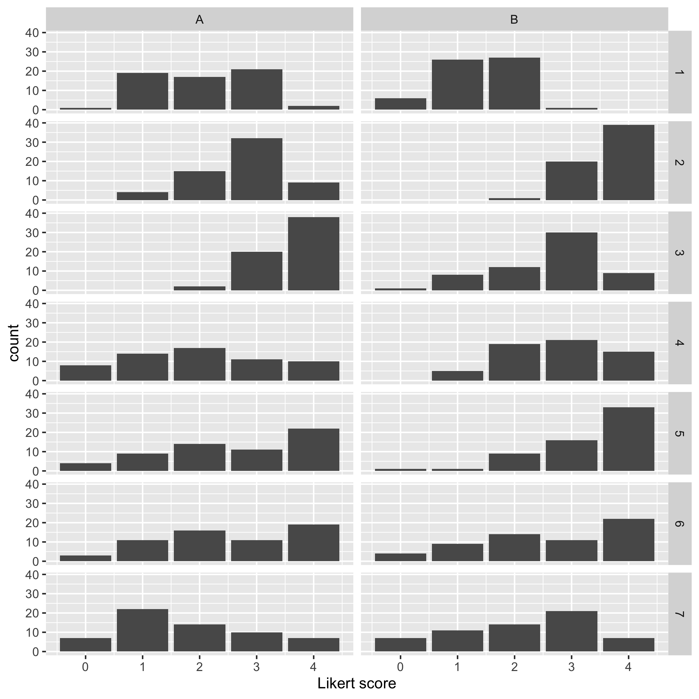

Fun with Likert
========

Make some fake unpaired Likert data, plot it, and analyze it with some
tests. This pretends that you have two groups (A and B), with 60
people in each group, and your survey has 6 questions, each scored on
a 0 to 4 Likert scale.

Results
========

Below is a table of *p* values, comparing group A to group B, for each
of the 6 questions. The following statistical tests (columns in the
table) are tried:

1. Wilcoxon rank sum, a.k.a. Mann-Whitney
2. T-test (unpaired)
3. Chi-squared test for trend in proportions (Cochran–Armitage test for trend)
4. Pearson's chi-squared test ("plain old" chi-squared that doesn't
know ordinal from categorical)

Some authors say that the t-test might be more appropriate than it
seems.[^norman][^sullivan]

[^norman]: Norman G. Adv Health Sci Educ Theory Pract. 2010
Dec;15(5):625-32. https://www.ncbi.nlm.nih.gov/pubmed/20146096

[^sullivan]: Sullivan & Artino. J Grad Med Educ. 2013 Dec; 5(4):
541–542. https://www.ncbi.nlm.nih.gov/pubmed/24454995


```
question wilcoxon_p    ttest_p     catt_p      chi_p
       1 0.00008753 0.00007020 0.00010058 0.00103063
       2 0.00000001 0.00000000 0.00000001 0.00000026
       3 0.00001583 0.00000899 0.00001415 0.00023930
       4 0.02493287 0.01268945 0.01277263 0.01143268
       5 0.00000512 0.00000393 0.00000805 0.00026705
       6 0.01127898 0.01054839 0.01079998 0.03702442
```

Plot of fake survey data (one question per row):



